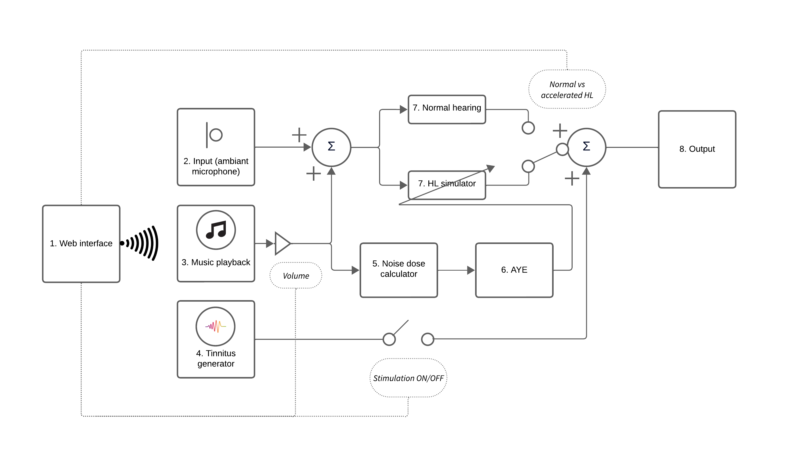
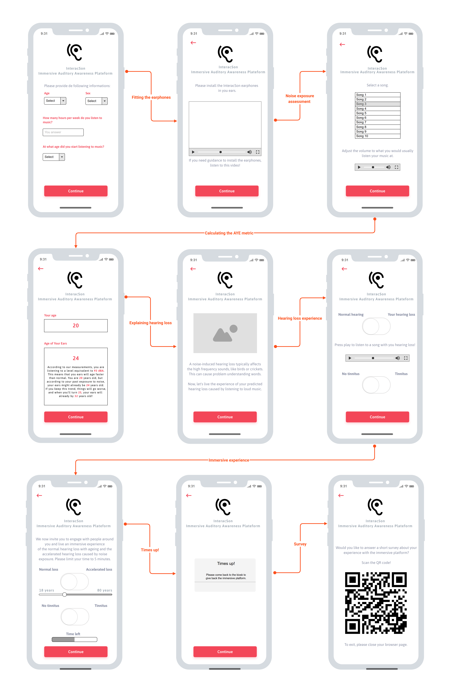

# InteracSon:An Immersive Auditory Platform for Awareness on Noise-Induced Hearing Risks
## Abstract
The Audio Research Platform developed by the ÉTS-EERS Industrial Research Chair in In-Ear technologies is a digital audio processing wearable device that features a powerful Digital Signal Processor and a pair of wired earplugs featuring outer- and inner-ear microphones as well as miniatrurize loudspeaker. ARP has been used since over the last 2 decades by CRITIAS to develop new algorithms for advanced hearing protection and communication in noise, as well as in-ear audio sensing. In this adaptation, the ARP enables transparent hearing of ambient sounds, simulates varying degrees of hearing loss, and includes a tinnitus simulator. ARP also functions as a personal music player, monitoring playback levels and displaying the "Age of your ears") a metric recently proposed by CRITIAS), predicting accelerated auditory aging from excessive music playback. In playback mode, wearers experience pre-recorded noise, prompting vocal adjustments known as the "Lombard Effect." ARP analyzes the wearer's voice using the outer-ear microphone, illustrating level and pitch shifts in speech due to a noisy environment. This paper details ARP's technical aspects, positioning it as a powerful tool to inform the public about noise-induced hearing loss and promote awareness and prevention through enjoyable real-time demonstrations.

## Authors
- Alexis Pinsonnault-Skvarenina
- Rachel Bouserhal
- Valentin Pintat
- Jérémie Voix (jeremie.voix@etsmtl.ca)

**Affiliation:** École de technologie supérieure, Université du Québec, Montréal, Canada

## Introduction

Disabling hearing loss affects approximately 4.6% of the global population, equating to around 466 million individuals. Projections suggest this number could escalate to 630 million by 2030 and surpass 900 million by 2050 \cite{world2024}. While age-related hearing loss is inevitable, preventing noise-induced hearing loss, which accounts for 10-16% of cases in industrialized nations \cite{dobie2008burdens}, is feasible. Alarmingly, over 1.1 billion people are at risk of hearing loss due to prolonged exposure to loud noise \cite{world2024}.

While many recreational pursuits are associated with heightened noise levels (i.e., nightclubs, social activities), personal media player (PMP) use among youths presents a significant risk factor for noise-induced hearing loss, with roughly 90% engaging in this activity \cite{vogel2009adolescents,levesque2010exposure}. Studies reveal concerning rates of hearing damage, with up to 49% of users experiencing auditory symptoms following PMP use \cite{levesque2010exposure}. Existing awareness and prevention programs face challenges in effectively altering adolescent behaviors.

To address these issues, we propose a personalized dosimetry platform allowing to measure actual noise doses based on individual music habits, combined with an immersive hearing loss experience to simulate hearing loss caused by specific music habits. Our initiative, *InteracSon*, a smart earphones platform, aims to educate youths about noise-induced hearing risks. By offering a novel approach to fostering safer music listening practices, *InteracSon* seeks to mitigate the prevalence of hearing loss among the younger population.

## Method

### InteracSon hardware

*InteracSon* evolved from the 5th iteration of the *Auditory Research Platform* (ARP5), originally developed at the *ETS-EERS Industrial Research Chair in In-Ear Technologies* (CRITIAS). Its electronic hardware comprises an ADAU1787 codec (Analog Devices, Norwood, MA, USA), a Teensy 4.1 microprocessor (PJRC, Portland, OR, USA), and an ESP32 Wi-Fi microcontroller (Espressif Systems, Shanghai, China). *InteracSon* features four audio input channels, and two speaker audio output options. Operating at a 48kHz sampling rate and 24-bit depth, it ensures high-fidelity audio capture and reproduction.

### InteracSon software

#### Modules

*InteracSon*'s software development utilizes the Teensyduino library, an open-source framework for the Teensy MCU platform, programmed in C++. ARP5 has been augmented with several modules to accommodate *InteracSon*'s functionalities:

1. Embedded web server module
2. Audio input module
3. Prerecorded audio file playback module
4. Tinnitus simulator module
5. Sound level meter module
6. *Age of Your Ears* calculation module
7. Audio equalizing module
8. Audio output module

*Figure: An overview of the different modules within *InteracSon* and their remote control via the smartphone web interface.*

#### Age of Your Ears

*InteracSon* uses the *Age of Your Ears* (AYE) metric \cite{voix2018inciting}, which involves adding an age penalty to an individual's real age to illustrate the accelerated noise-induced hearing loss. It is calculated to align the hearing threshold median of a normative person of the same gender with the noise-induced permanent threshold shift, which depends on the $L_{EX,A,8h}$ measurement. The AYE metric utilizes the statistical distribution of hearing thresholds outlined in ISO 1999 (2013) and ISO 7029 (2017) standards for its computation.

#### Hearing Loss and Tinnitus Simulator

To simulate the age-related or noise-induced hearing loss, digital audio filters have been designed in the Audio equalizing module. The filter responses match the *Age of Your Ears* metric. Finally, to simulate tinnitus, the *InteracSon* platform plays a basic 4kHz tone.

## Results

*Figure: *InteracSon*'s Web interface, as seen from the user's smartphone during the immersive audio experience.*

### User data collection and noise exposure evaluation: Determining the *Age of Your Ears*

Users begin by selecting their age and sex from drop-down menus. Then, they assess their weekly music listening duration and the age at which they started listening to music. Next, users are instructed to wear the *InteracSon* platform and insert the earphones into their ear canals. After, users are presented with a list of songs from which they can choose. They are then prompted to adjust the song's volume to match their typical listening level. With the selected volume and known audio system sensitivities, the precise sound pressure level (in dBA) of the music playback can be calculated, allowing computation of an equivalent level $L_{eq,A}$. These data are utilized to calculate the AYE metric.

### Hearing loss and tinnitus immersive experience

The predicted AYE guides the translation into hearing thresholds through the hearing loss immersive experience. This involves activating the earphones' acoustically transparent mode (unity insertion gain) and applying filters to the auditory output. Users can toggle between normal hearing and simulated hearing loss to better understand its consequences. They can also listen to their chosen song with and without simulated hearing loss. Additionally, users can opt to introduce tinnitus to their immersive experience. The platform also offers the option to switch between an age-related hearing loss (per ISO7029) and a noise-induced accelerated hearing loss (per ISO1999). Furthermore, users can adjust the desired “age” to experience the progressive degradation of hearing thresholds over time.

## Discussion and Conclusion

Youths face growing auditory risks, largely from prolonged exposure to loud noise sources like personal music players and recreational activities. Addressing these risks demands effective prevention strategies. *InteracSon* offers several key advantages to tackle these challenges:

1. Simplicity and clarity
2. Immersive learning experience
3. Real-time simulation
4. Tinnitus simulation
5. Flexible deployment
6. Stand-alone and narrative potential

The platform hasn't been tested by real users yet. Initial testing will be carried during the Quebec National Audition Day in May 2024.

This paper introduces the *InteracSon* platform, a wearable device that aims to educate about noise overexposure risks. It enables transparent hearing, simulates hearing loss, including tinnitus, and acts as a music player, monitoring levels and displaying the *Age of Your Ears* metric. Through personalized dosimetry and immersive experiences, *InteracSon*'s goal is to empower individuals to make informed choices about their auditory health, thus mitigating the global impact of noise-induced hearing impairments.

## Acknowledgments

The authors would like to acknowledge the financial support received from NSERC Alliance (ALLRP 566678-2021), MITACS IT26677 (SUBV-2021-168) and PROMPT (#164_Voix-EERS 2021.06), through the ÉTS-EERS Industrial Research Chair in In-Ear technologies (CRITIAS), sponsored by EERS Global Technologies Inc.

## References

